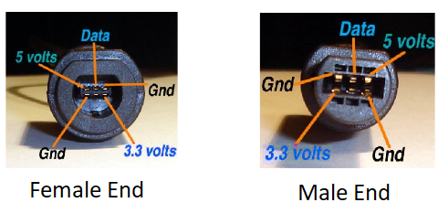
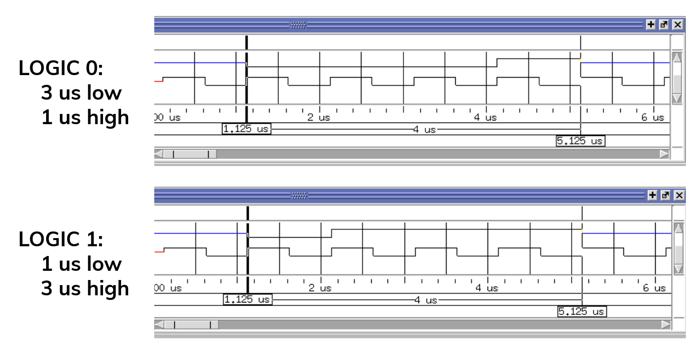

## GameCube Controller Protocol

As mentioned in the [README](../README.md), this project made extensive use of
the GameCube Controller Protocol documentation found
[here](http://www.int03.co.uk/crema/hardware/gamecube/gc-control.html). The
findings presented here were made possible by the research documented on that
website. The page does not appear to list the name of the author; nevertheless,
I'd like to thank the author for their time and effort.

---
## Pinout

The GameCube controller has six pins:

We consider only the male connector in the context of this project since the DK
Bongos have a male GameCube controller connector. A few things to note about
these pins:

1) Only five of the six pins are used
2) The two GND pins are shorted together
3) The 3.3V rail is used for data communications
4) The 5V rail is used for the rumble motor (unused for the DK Bongos)
5) The data line is used for bidirectional, open drain serial communications
with a pull up resistor to keep the line at 3.3V when idle (or when writing 
sending a "1")

---
## Bit Encoding

In the Gamecube Protocol, the clock rate is 1 MHz on the bidirectional serial
data line, but four clock pulses are required to send either a zero or a one,
meaning the maximum effective bit rate is actually 250 kbaud.

On the bidirectional serial data line, logic '0' is encoded as 0V for 3 clock
cycles, followed by 1 clock cycle at 3.3V. Similarly, logic '1' is encoded as
0V for 1 cycle of a 1 MHz clock, followed by 3 clock cycles at 3.3V:

---
## Commands

The GameCube Controller Protocol utilizes a master-slave communication model, where the GameCube is the master, and the controller is the slave. The controller will never freely offer state data to console and must be explicitly polled by the console.

In the case of the DK Bongos, that means that we must send a command to the DK Bongos to find out what inputs are active.

---

---

---

---

